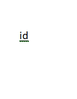
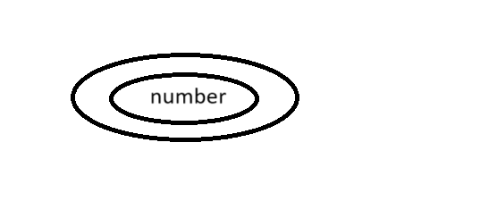
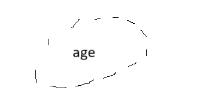
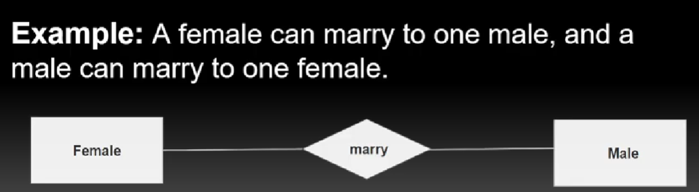
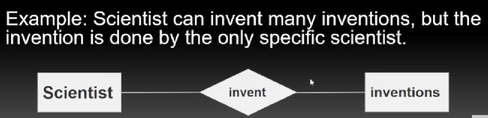
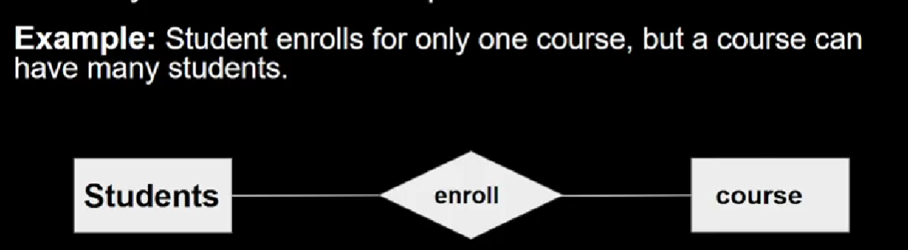
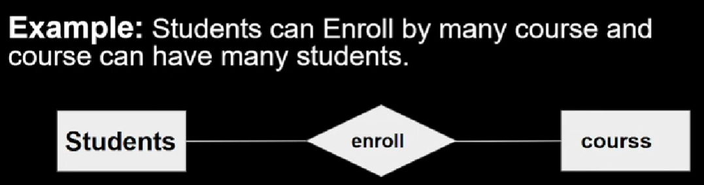

er = entity relationship diagram

in attributes we have:

1. key attribute - like id (with underline)

2. composite attribute:

like name - FIRST NAME
          - MIDDLE NAME
          - LAST NAME

here name is composite attribute

an attribute that composes many other attribute is called composite attribute.

3. Multi valued attribute:

a value which has more than 1 vale like phone numbers... denoted by double oval.

4. Derived attribute:

an attribute than can be derived from another attribute is called derived attribute.

like one attribute in table is dob.. from this attribute we can generate another attribute with this information like age. Current date - dob

denoted by dotted lines.

------------------------------------------------

relation ship:

a relation between two entities is called relationship.

can be represented by rhombus.

we have:

1. one - one relationship

2. one to many

3. Many to one:

4. many to many:

